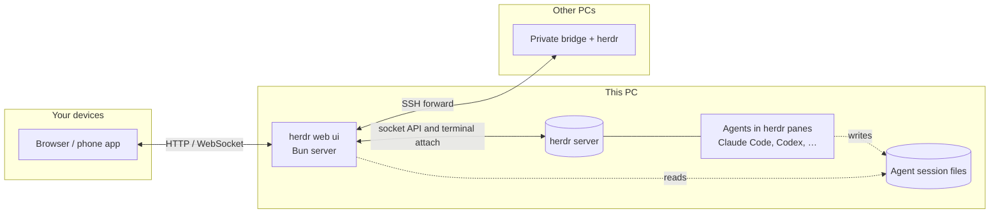

<p align="center">
  
</p>

<h1 align="center">herdr web ui</h1>

<p align="center"><b>Your herdr agents, in a browser and on your phone.</b><br>Read them as a chat, drop into the live terminal, answer when they ask — from any screen.</p>

<p align="center">
  <a href="https://devswha.github.io/herdr-web-ui/">Website</a> ·
  <a href="#quick-start">Quick start</a> ·
  <a href="#supported-agents">Agents</a> ·
  <a href="#on-your-phone">Phone</a> ·
  <a href="#remote-pcs-over-ssh">Remote PCs</a> ·
  <a href="#access-and-safety">Security</a> ·
  <a href="#faq">FAQ</a> ·
  <a href="CHANGELOG.md">Changelog</a>
</p>

<p align="center">
  <a href="https://github.com/devswha/herdr-web-ui/releases/latest"></a>
  <a href="LICENSE"></a>
  <a href="https://github.com/herdrdev/herdr"></a>
  
  
</p>

<p align="center">
  
</p>

[herdr](https://github.com/herdrdev/herdr) keeps your coding agents running in its terminals. herdr web ui is its browser and phone client: the same panes and the same live agents, whether you are at your desk, on the couch or on another continent.

- **Nothing in between.** Claude Code, Codex, omp, omo, gjc and the rest keep running in herdr exactly as you start them. There is no wrapper command, no second daemon and no account. herdr owns the sessions; this app reads herdr's socket and attaches to its terminals.
- **Chat and terminal, one pane.** Read the agent's own transcript as a chat, with its work folded per turn and its todo list pinned below. Flip to the real terminal for full-screen TUIs and raw keys.
- **Answer from anywhere.** Approval, question and plan menus show up as cards you answer with one tap. Push alerts tell you when an agent needs you or finishes, and stay quiet when you already answered at the PC.
- **Built for the phone.** It installs as an app, with a terminal key bar, touch scrolling of herdr's history, file and image attachments, and agent panes that open in the chat.
- **Every machine, one sidebar.** Add Linux and macOS PCs over SSH. Their agents join the list with the same chat, terminal and alerts.
- **Yours only.** It runs on your machine and listens on `127.0.0.1` by default. It sends nothing anywhere except GitHub (for its own updates) and your browser's push service.
- **Keeps itself current.** It installs releases in the background, health-checks the new build and rolls back if the check fails, without stopping herdr or your agents.

## A look around

<table>
  <tr>
    <td width="50%"></td>
    <td width="50%"></td>
  </tr>
  <tr>
    <td align="center"><b>Chat</b>: the agent's own transcript, work folded per turn</td>
    <td align="center"><b>Terminal</b>: the same pane, live, through <code>herdr terminal attach</code></td>
  </tr>
  <tr>
    <td colspan="2"></td>
  </tr>
  <tr>
    <td colspan="2" align="center"><b>Answer prompts</b>: approvals and questions become cards, answered from the chat</td>
  </tr>
</table>

<p align="center">
  
  
  
  
</p>

<details>
<summary><b>▶ Watch the demos in HD</b> (desktop 1920×1200, phone 1080×1920)</summary>

https://github.com/user-attachments/assets/4ca73671-ebfc-4c18-b8f2-99331abf9fa7

https://github.com/user-attachments/assets/2f030569-1004-425e-835d-9e775ec6e4c8

</details>

## Quick start

You need a running **[herdr](https://github.com/herdrdev/herdr) 0.9.0+**, **[Bun](https://bun.sh) 1.4+** and **Node 18+**. Node runs the terminal-attach sidecar. Nothing is compiled: the terminal addon comes prebuilt for Linux x64 and arm64 and for macOS, so no Python or C++ toolchain is needed.

> **Want a look first?** [Try it in your browser](https://devswha.github.io/herdr-web-ui/demo/): the app on a fictional session, nothing to install. Nothing in it is live.

> **Setting it up with a coding agent?** Point it at [INSTALL.md](INSTALL.md), a step-by-step guide written for agents.

**1. Install it as a herdr plugin** (recommended).

```bash
herdr plugin install devswha/herdr-web-ui
```

herdr builds the app and starts it along with itself, on `127.0.0.1:7317`, following the socket of the current herdr session.

<details>
<summary>Or run it from a checkout</summary>

```bash
git clone https://github.com/devswha/herdr-web-ui.git
cd herdr-web-ui
bun install
bun run start
```

`start` builds the client and runs the server under the update supervisor. It talks to `~/.config/herdr/herdr.sock` unless `HERDR_SOCKET` says otherwise.

</details>

**2. Open it** at **http://localhost:7317**. Every workspace and pane of your herdr session is in the sidebar. Pick one, or start a new agent with **New session**.

**3. Take it with you** (optional). Serve it over HTTPS, for example with Tailscale, and install it on your phone. See [On your phone](#on-your-phone).

To control the plugin:

```bash
herdr plugin action invoke devswha.herdr-web-ui.start    # leaves a running server alone
herdr plugin action invoke devswha.herdr-web-ui.status
herdr plugin action invoke devswha.herdr-web-ui.stop
```

**Headless PC?** With no browser to open Settings → Devices in, get a pairing code in the terminal:

```bash
bun "$(ls -d ~/.config/herdr/plugins/github/devswha.herdr-web-ui-* | head -1)/scripts/plugin.ts" pair   # plugin install
bun scripts/plugin.ts pair                                                                             # from a checkout
```

It prints the code, the address the phone opens when Tailscale serves one, and that address as a QR code. It is a command to run in a terminal, not a herdr action: herdr keeps an action's output in its log, and a pairing code belongs on the screen, not in a log.

Its PID and log live under `HERDR_PLUGIN_STATE_DIR`. For persistent settings (see [Configuration](#configuration)), add `KEY=value` lines to the `env` file in the directory that `herdr plugin config-dir devswha.herdr-web-ui` prints. Protect that file if it holds a token.

## Supported agents

Every agent herdr runs shows up with its live status, terminal and alerts. The chat view reads the agent's own session files wherever it knows where they are:

| Agent | Chat | Answer prompts from chat |
| --- | --- | --- |
| **Claude Code** | Native transcript, resolved through herdr | ✓ approvals, questions, plan and menu picks |
| **Codex** | Native rollout, with tool results and commentary/final phases | ✓ approvals and questions, including queued ones |
| **omp** | Native session file | ✓ |
| **omo** | Native session file, found through the pane's process tree | — use Terminal |
| **gjc** | Native session file, from the session directory gjc keeps open | — use Terminal |
| **Anything else** | The terminal's text | — use Terminal |

The model and reasoning effort come from what the session recorded, never from answer text. The todo list comes from Claude Code's `TodoWrite`, Codex's `update_plan`, or omp, omo and gjc todo calls. Details and verification are in the [chat-mode audit](docs/chat-mode-audit.md).

## Features

| | |
| --- | --- |
| **Read the conversation** | Prompts and Markdown answers (links, code blocks, tables). Each turn's commands, edits and progress are folded into one "Worked for …" block. Copy an answer as Markdown or plain text. |
| **Follow the plan** | The agent's todo list stays pinned to the bottom of the chat: the done count and the current item, or the whole list by phase when opened. |
| **Drop into the real terminal** | xterm.js on the live pane: full-screen TUIs, raw keys and herdr's scrollback, shared with your own herdr TUI. |
| **Answer prompts** | Approval, question and plan menus become cards. Tap an option, or type its number in the composer. The server checks that the menu is still current before answering. |
| **Compose** | `/` commands and `@` file mentions, any file or image attached by path, a draft per pane, and one queued message while the agent works. |
| **Follow every agent** | Live RUN / INPUT / DONE / READY status for all panes, and alerts when an agent needs input, finishes or its terminal ends. |
| **Open what agents make** | A file path in an answer opens in a viewer (images, video, audio, PDF, text), or find it with **Browse files**, and download it to your phone. |
| **Manage sessions** | Start an agent in a folder you type or pick with **Browse**, rename workspaces and panes, reorder workspaces, and jump anywhere from the command palette. |
| **Make it yours** | English or Korean, following the browser or chosen in Settings. Dark, light or system theme, compact density, terminal and chat font sizes, a resizable composer, Enter behavior and thinking visibility. |

## On your phone

Serve the app over **HTTPS** to install it and receive push alerts. The simplest way is Tailscale: keep the server on `127.0.0.1` and let Tailscale add the HTTPS address.

```bash
tailscale serve --bg --https=443 http://127.0.0.1:7317
```

Only devices in your tailnet can open that address. If they are all yours, that is the whole setup; otherwise, see [Access and safety](#access-and-safety).

**Settings → Phone** in the app does this step for you as far as it can: it shows the address Tailscale already serves for this PC as a QR code, or the exact command still to run, and the address it will give.

1. Open the address.
2. Install the app: in Safari, choose **Share → Add to Home Screen**; in Chrome, choose **Install app**.
3. Tap the bell to turn on alerts for that device. iPhone needs iOS 16.4+ and the home-screen app.

On a phone:
- Agent panes open in the chat.
- The terminal gets a key bar above the keyboard (Esc, Tab, Ctrl, arrows, Ctrl+C).
- Dragging the terminal scrolls the real herdr pane.

A plain HTTP LAN address also works in the browser, but it can't install the app or receive push.

The running server sends the alerts. Keep it running, and keep `HERDR_WEB_STATE_DIR` across restarts, since it holds the push key and device subscriptions.

## Remote PCs over SSH

Choose **Add PC** in the sidebar and enter an SSH alias or `user@host` for a Linux or macOS computer. The setup dialog walks you through the host fingerprint, the password or key passphrase, and an explicit install approval. The PC's workspaces then join the sidebar, and chat, files, terminal input and alerts all follow the PC you pick.

- **SSH runs on the server**, as the web server's account, with its OpenSSH configuration and agent. The browser never opens SSH itself.
- **The remote side gets a private runtime bundle** and a loopback-only bridge, reached through an SSH forward.
- **A herdr already running there** is never stopped or replaced.
- **Bridge updates:** when an app update needs a newer bridge, PCs that connect with their saved key are updated in the background.

More in [remote PCs](docs/remote-pcs.md).

## Access and safety

Anyone who can reach the server can type into your terminals, so what matters is who gets in. It listens on `127.0.0.1` by default, which means only this computer. From anywhere else, a request gets in in one of three ways:

- **It is you, says Tailscale.** `tailscale serve` states the requesting device's Tailscale login in a header it strips from anything incoming. A login that matches this PC's own gets in; another login is refused. Nothing to set up.
- **It is a paired device.** **Settings → Devices**, on the PC (or on a device already paired), shows a six-digit code that lives ten minutes and a QR code that carries it. On a headless PC, the `pair` command prints the same in its terminal (see [Quick start](#quick-start)); Devices also shows the pairing link as text, to send to the other device. The other device enters it once and keeps its own credential in an HttpOnly cookie; the list shows it, and **Revoke** ends it at its next request.
- **It holds the token.** `HERDR_WEB_TOKEN`, for scripts and proxies, as a cookie after sign-in or as `Authorization: Bearer <token>`. When a token is set it gates everything, this computer included, as before.

| How you reach it | What gets you in |
| --- | --- |
| This computer only (default) | Nothing needed |
| SSH tunnel (`ssh -L 7317:127.0.0.1:7317 host`) | Nothing needed |
| `tailscale serve`, your own devices | Nothing needed: your login |
| `tailscale serve` on a tailnet you share with others | Your devices: your login. Theirs: refused unless you pair them |
| Your LAN (`HOST=0.0.0.0` or a LAN address) | Pair each device, or set a token |
| A public domain or reverse proxy | Pair each device, or set a token, with HTTPS. The proxy must send `X-Forwarded-For`. Never `tailscale funnel` it |

Until the first device is paired, and with no token set, a LAN or proxied address is open to anyone who reaches it, as it always was: the server warns on startup. Pairing the first device closes it for good; revoking every device does not reopen it. This computer itself stays in whatever happens, so you can never lock yourself out: revoke everything and pair again from `http://localhost:7317`.

A TLS proxy should send `x-forwarded-proto: https` so cookies are marked Secure. The pairing code is a one-time secret: five wrong tries spend it.

Nothing is typed without you:
- Input typed while disconnected waits as a draft for you to send or discard.
- A queued message goes only to the pane it was written for, once the agent is ready.
- An answer typed to a prompt waits for **Confirm**.

Attaches never use `--takeover`, so they coexist with your own herdr TUI.

## Configuration

| Variable | Default | Purpose |
| --- | --- | --- |
| `HOST` | `127.0.0.1` | Bind address. Use `0.0.0.0` or a LAN address only together with `HERDR_WEB_TOKEN`. |
| `PORT` | `7317` | HTTP and WebSocket port |
| `HERDR_SOCKET` | `~/.config/herdr/herdr.sock` | herdr socket for API calls and terminal attach. For a named session, use `~/.config/herdr/sessions/<name>/herdr.sock`. |
| `HERDR_WEB_TOKEN` | unset | Shared token that gates all access |
| `HERDR_WEB_STATE_DIR` | `~/.config/herdr-web-ui` | Push keys, device subscriptions, PC registrations and update builds |
| `HERDR_WEB_AUTO_UPDATE` | `0` | `1` installs new releases without asking |
| `HERDR_WEB_PUSH_SUBJECT` | this repository's URL | VAPID contact URL or `mailto:` address |
| `HERDR_WEB_BUNDLE_MANIFEST` | unset | Remote-PC bundle manifest (path or URL) that overrides local and published bundles |
| `HERDR_WEB_HERDR_BIN` | `herdr` | herdr executable used for terminal attach |
| `CODEX_HOME` | `~/.codex` | Where Codex sessions are read |

## Updates

`bun run start` and the plugin look for a newer **release** 10 seconds after start and then every 5 minutes. A release is a `vX.Y.Z` tag ([changelog](CHANGELOG.md)); commits between releases never reach installs. When a new version is out, the header names it, and **Settings → Updates** installs it. To install releases without asking, set `HERDR_WEB_AUTO_UPDATE=1`.

An update is built and typechecked in a private checkout while the current server keeps serving. The new server must pass a health check, or the previous build comes back. herdr and your agents keep running, and a **Reload app** notice lets you save drafts before the new frontend loads.

Updates need a clean checkout: `main` for a source install, or herdr's plugin checkout. Local changes block an update, and they are never overwritten. More in [app updates](docs/app-updates.md).

## Keyboard shortcuts

`Mod` is **⌘** on macOS and **Ctrl** elsewhere. Every shortcut adds Shift, so the terminal keeps its own Ctrl keys.

| Shortcut | Action |
| --- | --- |
| `Mod+Shift+K` | Command palette |
| `Mod+Shift+J` | Switch Chat / Terminal |
| `Mod+Shift+B` | Toggle sidebar |
| `Mod+Shift+N` | New session |
| `Mod+Shift+↑` / `↓` | Previous / next pane |
| `Mod+Shift+,` | Settings |

Enter sends and Shift+Enter adds a line. Settings can switch sending to Mod+Enter.

## How it works



A React client talks to a Bun HTTP/WebSocket server.

- **Status:** the server reads workspaces and agent status from herdr's Unix socket.
- **Terminal:** it streams the real `herdr terminal attach` output through a Node PTY sidecar. Browsers watching one pane share one attach, with a bounded replay and backpressure ([terminal flow control](docs/terminal-flow-control.md)).
- **Chat:** it reads the agents' own session files, and sending types into the same live pane.

herdr owns the processes and the scrollback.

## FAQ

<details>
<summary><b>Does it replace herdr's own TUI?</b></summary>

No. Both attach to the same terminals at the same time. Use the TUI at your desk and the web app anywhere else. Nothing needs to be stopped or handed over.
</details>

<details>
<summary><b>Do I need Tailscale?</b></summary>

No, but a phone needs two things Tailscale gives at once: a way to reach the PC from outside your network, and HTTPS, which installing the app and push alerts both require. Without it:

- **An SSH tunnel from the phone** (Termux, Blink): `ssh -L 7317:127.0.0.1:7317 <pc>`, then open `http://localhost:7317` on the phone. Browsers treat localhost as secure, so installing and alerts should work while the tunnel is up (not verified on iOS yet). The phone still has to reach the PC over SSH.
- **A VPN into your home** (WireGuard, ZeroTier, a router VPN): the LAN address works in the browser, but a plain `http://` address can neither install the app nor receive alerts.
- **A reverse proxy with a real certificate** on a domain you own, with a token set. This exposes the server to the internet, so read [Access and safety](#access-and-safety) first.
</details>

<details>
<summary><b>Does my code or conversation leave my machine?</b></summary>

No. The server reads session files and terminals locally, and serves them only to browsers that can reach it. Its only outbound connections are:
- GitHub, for release checks, update builds and remote-PC bundles
- your browser vendor's push service, for alerts, which carries an encrypted notification
</details>

<details>
<summary><b>An agent is missing from the chat, or shows only terminal text.</b></summary>

The chat needs the agent's own session file. Check that the agent runs in a herdr pane on this PC (or on an added PC) and has already written its first message. Agents without a native reader always get the terminal-text view, and the Terminal view always works.
</details>

<details>
<summary><b>How is this different from collie, roamgate or herdr-remote?</b></summary>

All three are in the herdr plugin marketplace too, and each does something this app does not. [collie](https://github.com/AltanS/collie) is a mobile terminal for herdr, tmux and zellij, with a status dashboard, a key pad, quick replies and voice input, served over Tailscale by its own bridge. [roamgate](https://github.com/powerfooI/roamgate) is a browser client for herdr with a file explorer and diff annotations, installed by its own script. [herdr-remote](https://github.com/dcolinmorgan/herdr-remote) is a macOS menu-bar app with a phone dashboard and a Telegram bot behind a relay and a free tunnel.

herdr web ui reads the agent's own transcript, so Claude Code, Codex, omp, omo and gjc panes are a chat with the work folded per turn, and a prompt card is checked against the live menu before its answer is typed. The terminal is the same live pane as your TUI, other PCs join over SSH from the sidebar, and it installs and updates as a herdr plugin, with no server or account of its own. It brings no tunnel: you reach it over Tailscale, SSH or your own HTTPS proxy. If you want tmux or zellij, diffs, Telegram or a tunnel out of the box, one of the others is the better fit.
</details>

<details>
<summary><b>How is this different from Happy, Paseo or CloudCLI UI?</b></summary>

Those projects start and manage agents through their own wrapper, daemon or server, and bring their own apps. herdr web ui adds nothing between you and the agent. It is a window onto the herdr sessions you already run, so the same pane is live in your terminal, your browser and your phone at once. If you don't use herdr, one of those is the better fit.
</details>

## Development

```bash
bun install
bun run server   # API + WebSocket on :7317
bun run dev      # Vite on :5173
bun run typecheck && bun test && bun run test:ui
```

Tests use a herdr session of their own, so they never touch the one you work in. Checks, README media, releases and the repository layout are covered in [docs/development.md](docs/development.md). Design tokens and UI conventions are in [DESIGN.md](DESIGN.md).

## Acknowledgments

- [herdr](https://github.com/herdrdev/herdr) (Apache-2.0), the terminal runtime this app is a window onto.
- [chatmux](https://github.com/devswha/chatmux), which inspired the browser bridge and the chat experience.
- [xterm.js](https://xtermjs.org), [React](https://react.dev), [Bun](https://bun.sh) and [Lucide](https://lucide.dev).
- Everyone who has sent a pull request, among them [@Yoonwoo-Ha](https://github.com/Yoonwoo-Ha).

## License

[MIT](LICENSE). Copyright © 2026 devswha.
