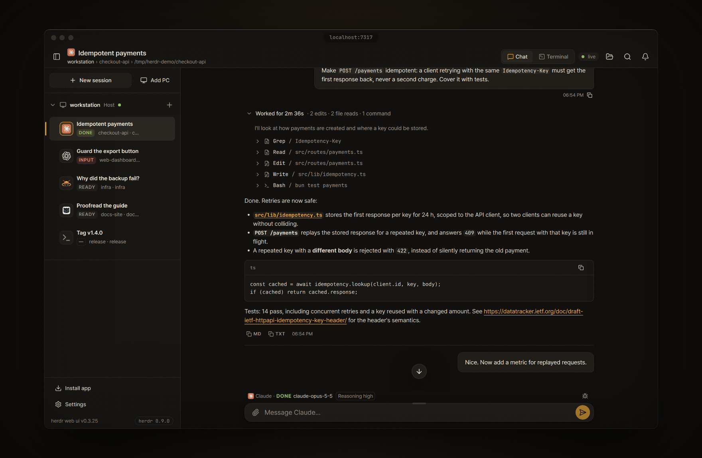
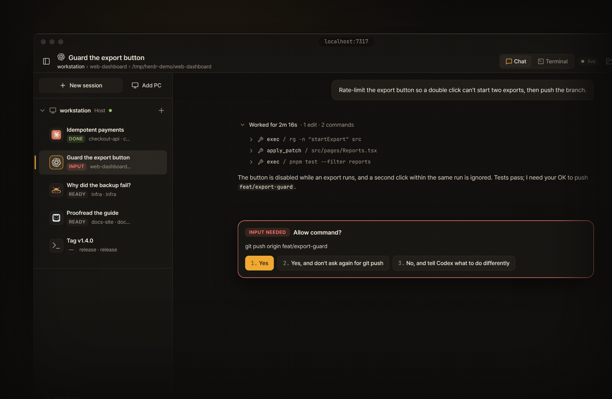
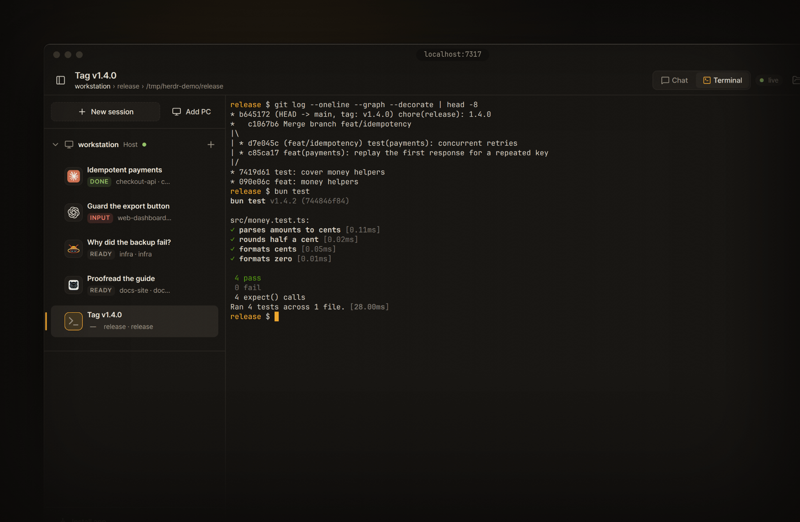
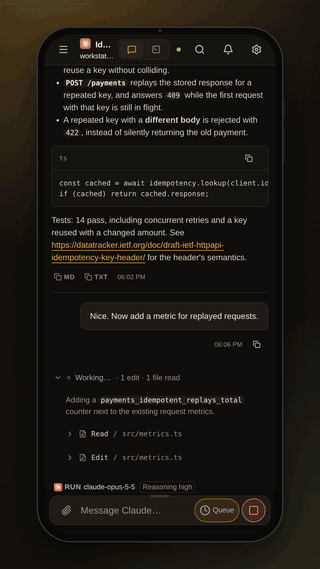
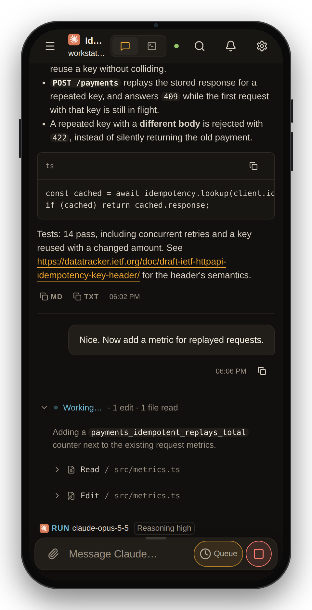
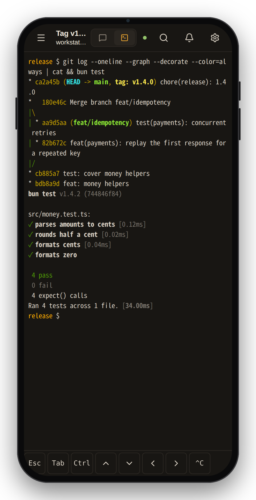
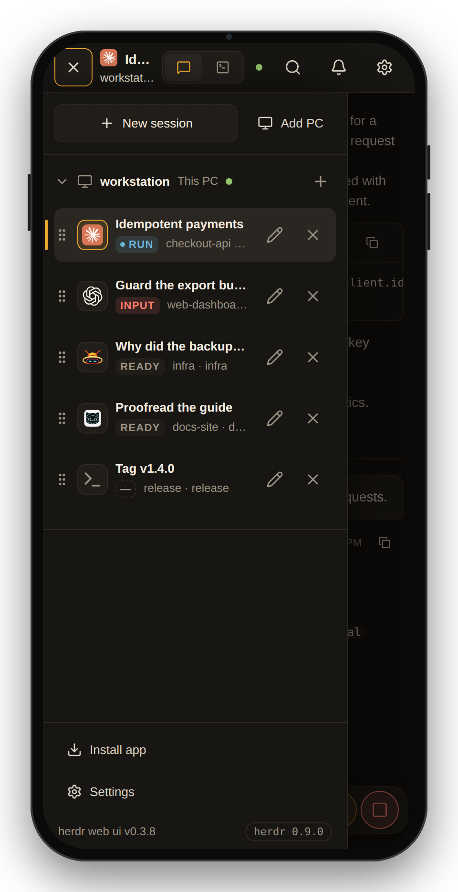
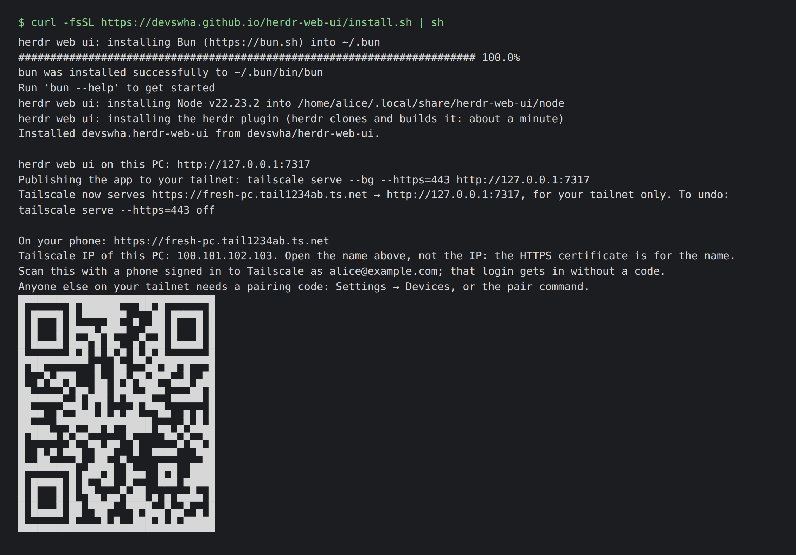
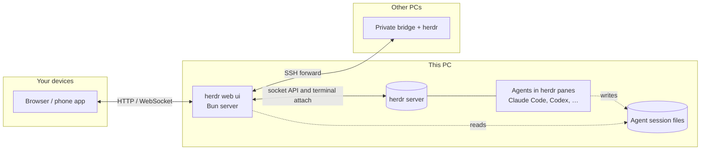

# User guide

[← README](../README.md) · [Quick start](#quick-start) · [Supported agents](#supported-agents) · [Features](#features) · [Phone](#on-your-phone) · [Remote PCs](#remote-pcs-over-ssh) · [Access and safety](#access-and-safety) · [Configuration](#configuration) · [Updates](#updates) · [Keyboard shortcuts](#keyboard-shortcuts) · [How it works](#how-it-works) · [FAQ](#faq)

Install, connect and use herdr web ui on your desktop and phone.

## A look around

<table>
  <tr>
    <td colspan="2"></td>
  </tr>
  <tr>
    <td colspan="2" align="center"><b>Chat</b>: the agent's own transcript, each turn's work folded into one line you can open</td>
  </tr>
  <tr>
    <td width="50%"></td>
    <td width="50%"></td>
  </tr>
  <tr>
    <td align="center"><b>Answer prompts</b>: approvals and questions become cards, answered from the chat</td>
    <td align="center"><b>Terminal</b>: the same pane, live, through<br><code>herdr terminal attach</code></td>
  </tr>
</table>

<p align="center">
  
  
  
  
</p>

<details>
<summary><b>▶ Watch the demos in HD</b> (desktop 1920×1200, phone 1080×1920)</summary>

https://github.com/user-attachments/assets/4ca73671-ebfc-4c18-b8f2-99331abf9fa7

https://github.com/user-attachments/assets/2f030569-1004-425e-835d-9e775ec6e4c8

</details>

## Quick start

> **Want a look first?** [Try it in your browser](https://devswha.github.io/herdr-web-ui/demo/): the app on a fictional session, nothing to install. Nothing in it is live.

> **Setting it up with a coding agent?** Point it at [INSTALL.md](../INSTALL.md), a step-by-step guide written for agents.

**1. Install it** with one line, on Linux (x64, arm64) or macOS:

```bash
curl -fsSL https://devswha.github.io/herdr-web-ui/install.sh | sh
```

It does, in order, only what is not done yet:

- **What it runs on.** [herdr](https://github.com/herdrdev/herdr) 0.9.0+, [Bun](https://bun.sh) 1.4+ and Node 18+ (Node runs the terminal sidecar). A missing one is installed for your user only, without sudo: herdr and Bun by their own installers, into `~/.local/bin` and `~/.bun`, and Node 22 from nodejs.org, checked against its published SHA-256, into `~/.local/share/herdr-web-ui/node`. Nothing is compiled.
- **The app**, as a herdr plugin: herdr builds it and starts it along with itself, on `127.0.0.1:7317`, following the socket of the current herdr session. When herdr is already running, the app starts now.
- **The phone address.** When Tailscale runs on this PC, it serves the app to your tailnet (`tailscale serve`, see [On your phone](#on-your-phone)), tells you the command that undoes it, and prints the address as a QR code. Without Tailscale, it says what to set up.

Run it again at any time, for example after setting up Tailscale: it keeps what is there and prints the address and QR code again.

<p align="center">
  
</p>

<sub>A PC named fresh-pc on a sample tailnet (alice@example.com): the names and the QR code are placeholders.</sub>

<details>
<summary>Other ways to install</summary>

**The plugin alone**, when herdr, Bun and Node are there already. After installing, choose
the plugin's **Phone setup** action inside herdr to see the address, QR and a pairing code.

```bash
herdr plugin install devswha/herdr-web-ui
```

**From a checkout:**

```bash
git clone https://github.com/devswha/herdr-web-ui.git
cd herdr-web-ui
bun install
bun run start
```

`start` builds the client and runs the server under the update supervisor. It talks to `~/.config/herdr/herdr.sock` unless `HERDR_SOCKET` says otherwise.

</details>

**2. Open it** at **http://localhost:7317**. Every workspace and pane of your herdr session is in the sidebar. Pick one, or start a new agent with **New session**.

**3. Take it with you.** Scan the installer's QR code with a phone signed in to the same Tailscale account, then install the app from the browser. See [On your phone](#on-your-phone).

### In a terminal

**The phone address, again:** run the one-line installer again. On a PC where the app is installed it installs nothing and prints the address and its QR code, serving the app to your tailnet first if nothing does yet. It finds the version that actually runs: herdr's plugin directory keeps the version first installed, and **Settings → Updates** runs newer ones from `~/.config/herdr-web-ui/updates`. From a checkout, `bun scripts/plugin.ts phone` does the same.

**A pairing code, on a PC with no browser of its own:**

```bash
bun "$(ls -d ~/.config/herdr/plugins/github/devswha.herdr-web-ui-* | head -1)/scripts/plugin.ts" pair   # plugin install
bun scripts/plugin.ts pair                                                                             # from a checkout
```

`pair` prints the code, the address the phone opens when Tailscale serves one, and that address as a QR code. Neither is a herdr action: herdr keeps an action's output in its log, and a pairing code belongs on the screen. The actions start, stop and report on the server:

```bash
herdr plugin action invoke devswha.herdr-web-ui.start    # leaves a running server alone
herdr plugin action invoke devswha.herdr-web-ui.status
herdr plugin action invoke devswha.herdr-web-ui.phone    # visible phone setup pane
herdr plugin action invoke devswha.herdr-web-ui.stop
```

Its PID and log live under `HERDR_PLUGIN_STATE_DIR`. For persistent settings (see [Configuration](#configuration)), add `KEY=value` lines to the `env` file (no dot) in the directory that `herdr plugin config-dir devswha.herdr-web-ui` prints. A plugin checkout from 0.3.25 on also reads `.env` there, which wins where both set a key; an older one needs a plugin reinstall first, since in-app updates do not replace the checkout. The plugin's `status` prints the files it read. Protect that file if it holds a token.

### Uninstall

```bash
herdr plugin action invoke devswha.herdr-web-ui.stop
herdr plugin uninstall devswha.herdr-web-ui
tailscale serve --https=<port> off    # the port the installer printed, if it served the app
```

The installer's herdr, Bun and Node stay, since other tools may use them: `~/.local/bin/herdr`, `~/.bun`, and `~/.local/share/herdr-web-ui/node` with its link `~/.local/bin/node`. Push keys and paired devices are in `~/.config/herdr-web-ui`.

## Supported agents

Every agent herdr runs shows up with its live status, terminal and alerts. The chat view reads the agent's own session files wherever it knows where they are:

| Agent | Chat | Answer prompts from chat |
| --- | --- | --- |
| **Claude Code** | Native transcript, resolved through herdr | ✓ approvals, questions, plan and menu picks |
| **Codex** | Native rollout, with tool results and commentary/final phases | ✓ approvals and questions, including queued ones |
| **omp** | Native session file | ✓ |
| **omo** | Native session file, found through the pane's process tree | — use Terminal |
| **gjc** | Native session file, from the session directory gjc keeps open | — use Terminal |
| **Anything else** | The terminal's text | — use Terminal |

When the last visible line is a familiar password, SSH passphrase or PIN request, both
views show a **Password or PIN** field. It hides what you type and sends it directly
to the terminal with Enter. The value is cleared on send, cancel, disconnect, pane
change or when the page goes into the background. It never enters the message queue,
draft storage or chat history. A changed prompt or busy pane refuses the send; check
the terminal before entering it again. **Cancel** sends Ctrl+C. Remote PCs need bridge
bundle v6. Detection covers a narrow list of English prompts, not every program or language.

The model and reasoning effort come from what the session recorded, never from answer text. A todo list shows where the agent recorded it, in the turn's work block: Claude Code's `TodoWrite`, Codex's `update_plan`, or omp, omo and gjc todo calls. Plain-text plans and Claude Code `TaskCreate` / `TaskUpdate` calls are not currently reconstructed. Details and verification are in the [chat-mode audit](chat-mode-audit.md).

## Features

| | |
| --- | --- |
| **Read the conversation** | Prompts and Markdown answers (links, code blocks, tables). Each turn's commands, edits and progress are folded into one "Worked for …" block. Copy an answer as Markdown or plain text. |
| **Follow the plan** | A supported todo-tool call folds into the turn's work block like any tool: it reads as the done count or the step it took, and opened, as the whole list by phase. |
| **Drop into the real terminal** | xterm.js on the live pane: full-screen TUIs, raw keys and herdr's scrollback, shared with your own herdr TUI. Drag to select the visible text and it is copied on release; Ctrl+C copies a selection instead of interrupting. |
| **Answer prompts** | Approval, question and plan menus become cards. Tap an option, or type its number in the composer. The server checks that the menu is still current before answering. |
| **Compose** | `/` commands and `@` file mentions, any file or image attached by path, a draft per pane, and multiple queued messages while the agent works. |
| **Follow every agent** | Live RUN / INPUT / DONE / READY status for all panes, and alerts when an agent needs input, finishes or its terminal ends. |
| **Open what agents make** | A file path in an answer opens in a viewer (images, video, audio, PDF, text), or find it with **Browse files**, and download it to your phone. |
| **Manage sessions** | Start an agent in a folder you type or pick with **Browse**, rename workspaces and panes, reorder workspaces, and jump anywhere from the command palette. |
| **Make it yours** | English, Korean, Japanese or Simplified Chinese, following the browser or chosen in Settings. Dark, light or system theme, compact density, terminal and chat font sizes, a resizable composer, Enter behavior and thinking visibility. |

## On your phone

Serve the app over **HTTPS** to install it and receive push alerts. The simplest way is Tailscale: keep the server on `127.0.0.1` and let Tailscale add the HTTPS address.

```bash
tailscale serve --bg --https=443 http://127.0.0.1:7317
```

The one-line installer runs this for you when Tailscale runs on the PC and does not serve the app yet, on the first free port of 443, 8443, 7317 and 17317, and prints the command that undoes it. On Linux, `tailscale serve` needs root or `sudo tailscale set --operator=$USER` once; the installer says so when Tailscale refuses.

Only devices in your tailnet can open that address, and only yours get in without a code: see [Access and safety](#access-and-safety).

**Settings → Phone** in the app does this step for you as far as it can: it shows the address Tailscale already serves for this PC as a QR code, or the exact command still to run, and the address it will give.

1. Open the address.
2. Install the app: in Safari, choose **Share → Add to Home Screen**; in Chrome, choose **Install app**.
3. Tap the bell to turn on alerts for that device. iPhone needs iOS 16.4+ and the home-screen app.

To check alerts later, choose **Settings → Alerts → Send test**. The result tells you
whether the test was sent or failed; a missing subscription offers **Turn alerts on again**.

On a phone:
- Agent panes open in the chat.
- The terminal gets a key bar above the keyboard (Esc, Tab, Ctrl, arrows, Ctrl+C).
- Dragging the terminal scrolls the real herdr pane.
- **Settings → Phone → Keep screen on** keeps the screen awake while a terminal or chat
  pane is open. It is off by default, releases when the app is hidden, and resumes when
  you return. It needs HTTPS or localhost and browser support; power-saving mode may refuse it.

A plain HTTP LAN address also works in the browser, but it can't install the app or receive push.

The running server sends the alerts. Keep it running, and keep `HERDR_WEB_STATE_DIR` across restarts, since it holds the push key and device subscriptions.

## Remote PCs over SSH

Agents waiting for an answer appear in **Needs you** at the top of the sidebar, including
those on collapsed PCs. Choose a row to open its pane on the correct PC. The shortcut
disappears when the agent resumes or the PC disconnects; workspace order stays unchanged.

Choose **Add PC** in the sidebar and enter an SSH alias or `user@host` for a Linux or macOS computer. The setup dialog walks you through the host fingerprint, the password or key passphrase, and an explicit install approval. The PC's workspaces then join the sidebar, and chat, files, terminal input and alerts all follow the PC you pick.

- **SSH runs on the server**, as the web server's account, with its OpenSSH configuration and agent. The browser never opens SSH itself.
- **The remote side gets a private runtime bundle** and a loopback-only bridge, reached through an SSH forward.
- **A herdr already running there** is never stopped or replaced.
- **Bridge updates:** when an app update needs a newer bridge, PCs that connect with their saved key are updated in the background.

More in [remote PCs](remote-pcs.md).

## Access and safety

Anyone who can reach the server can type into your terminals, so what matters is who gets in. It listens on `127.0.0.1` by default, which means only this computer. From anywhere else, a request gets in in one of three ways:

- **It is you, says Tailscale.** `tailscale serve` states the requesting device's Tailscale login in a header it strips from anything incoming. A login that matches this PC's own gets in; another login is refused, and a tagged device (one with no person's login) needs pairing. Nothing to set up.
- **It is a paired device.** **Settings → Devices**, on the PC (or on a device already paired), shows a six-digit code that lives ten minutes and a QR code that carries it. On a headless PC, the `pair` command prints the same in its terminal (see [In a terminal](#in-a-terminal)); Devices also shows the pairing link as text, to send to the other device. The other device enters it once and keeps its own credential in an HttpOnly cookie; the list shows it, and **Revoke** immediately closes its terminal connections and roster stream and refuses subsequent requests.
- **It holds the token.** `HERDR_WEB_TOKEN`, for scripts and proxies, as a cookie after sign-in or as `Authorization: Bearer <token>`. When a token is set it gates everything, this computer included, as before.

| How you reach it | What gets you in |
| --- | --- |
| This computer only (default) | Nothing needed |
| SSH tunnel (`ssh -L 7317:127.0.0.1:7317 host`) | Nothing needed |
| `tailscale serve`, your own devices | Nothing needed: your login |
| `tailscale serve` on a tailnet you share with others | Your devices: your login. Theirs: refused unless you pair them |
| Your LAN (`HOST=0.0.0.0` or a LAN address) | Pair each device, or set a token |
| A public domain or reverse proxy | Pair each device, or set a token, with HTTPS. The proxy must send `X-Forwarded-For`. Never `tailscale funnel` it |

Until the first device is paired, and with no token set, a LAN or proxied address is open to anyone who reaches it, as it always was: the server warns on startup. The exception is a proxy on this PC while its Tailscale login is known, as with `tailscale serve`: a request that carries no login there needs pairing from the start. Pairing the first device closes it for good; revoking every device does not reopen it. This computer itself stays in whatever happens, so you can never lock yourself out: revoke everything and pair again from `http://localhost:7317`.

A TLS proxy should send `x-forwarded-proto: https` so cookies are marked Secure. The pairing code is a one-time secret: five wrong tries spend it.

**Sign out** in the header or command palette clears this browser's token and device cookies; terminal sessions and agents keep running. It is shown for token or device authentication, not automatic local or Tailscale access.

If `devices.json` under `HERDR_WEB_STATE_DIR` (default `~/.config/herdr-web-ui`) is corrupt or unreadable, the server keeps unrecognized external clients out and preserves the file. Local access without a configured token, a valid token, and the owner's trusted Tailscale login still work. Settings → Devices and the server log explain the error. Restore a valid registry from backup or fix its permissions, then restart; pairing and device changes remain disabled until it is repaired.

Nothing is typed without you:
- Input typed while disconnected waits as a draft for you to send or discard.
- Queued messages stay with their PC and pane across reloads. Edit, discard, or explicitly send each item; status changes and reconnects never send them automatically.
- An answer typed to a prompt waits for **Confirm**.

Attaches never use `--takeover`, so they coexist with your own herdr TUI.

## Configuration

| Variable | Default | Purpose |
| --- | --- | --- |
| `HOST` | `127.0.0.1` | Bind address. Use `0.0.0.0` or a LAN address only together with `HERDR_WEB_TOKEN`. |
| `PORT` | `7317` | HTTP and WebSocket port |
| `HERDR_SOCKET` | `~/.config/herdr/herdr.sock` | herdr socket for API calls and terminal attach. For a named session, use `~/.config/herdr/sessions/<name>/herdr.sock`. |
| `HERDR_WEB_TOKEN` | unset | Shared token that gates all access |
| `HERDR_WEB_STATE_DIR` | `~/.config/herdr-web-ui` | Push keys, device subscriptions, PC registrations and update builds |
| `HERDR_WEB_AUTO_UPDATE` | `0` | `1` installs new releases without asking |
| `HERDR_WEB_PUSH_SUBJECT` | this repository's URL | VAPID contact URL or `mailto:` address |
| `HERDR_WEB_BUNDLE_MANIFEST` | unset | Remote-PC bundle manifest (path or URL) that overrides local and published bundles |
| `HERDR_WEB_HERDR_BIN` | `herdr` | herdr executable used for terminal attach |
| `CODEX_HOME` | `~/.codex` | Where Codex sessions are read |

## Updates

`bun run start` and the plugin look for a newer **release** 10 seconds after start and then every 5 minutes. A release is a `vX.Y.Z` tag ([changelog](../CHANGELOG.md)); commits between releases never reach installs. When a new version is out, the header names it, and **Settings → Updates** installs it. To install releases without asking, set `HERDR_WEB_AUTO_UPDATE=1`.

An update is built and typechecked in a private checkout while the current server keeps serving. The new server must pass a health check, or the previous build comes back. herdr and your agents keep running, and a **Reload app** notice lets you save drafts before the new frontend loads.

Updates need a clean checkout: `main` for a source install, or herdr's plugin checkout. Local changes block an update, and they are never overwritten. More in [app updates](app-updates.md).

## Keyboard shortcuts

`Mod` is **⌘** on macOS and **Ctrl** elsewhere. Every shortcut adds Shift, so the terminal keeps its own Ctrl keys.

| Shortcut | Action |
| --- | --- |
| `Mod+Shift+K` | Command palette |
| `Mod+Shift+J` | Switch Chat / Terminal |
| `Mod+Shift+B` | Toggle sidebar |
| `Mod+Shift+N` | New session |
| `Mod+Shift+↑` / `↓` | Previous / next pane |
| `Mod+Shift+,` | Settings |

Enter sends and Shift+Enter adds a line. Settings can switch sending to Mod+Enter.

## How it works



A React client talks to a Bun HTTP/WebSocket server.

- **Status:** the server reads workspaces and agent status from herdr's Unix socket.
- **Terminal:** it streams the real `herdr terminal attach` output through a Node PTY sidecar. Browsers watching one pane share one attach, with a bounded replay and backpressure ([terminal flow control](terminal-flow-control.md)).
- **Chat:** it reads the agents' own session files, and sending types into the same live pane.

herdr owns the processes and the scrollback.

## FAQ

<details>
<summary><b>Does it replace herdr's own TUI?</b></summary>

No. Both attach to the same terminals at the same time. Use the TUI at your desk and the web app anywhere else. Nothing needs to be stopped or handed over.
</details>

<details>
<summary><b>Do I need Tailscale?</b></summary>

No, but a phone needs two things Tailscale gives at once: a way to reach the PC from outside your network, and HTTPS, which installing the app and push alerts both require. Without it:

- **An SSH tunnel from the phone** (Termux, Blink): `ssh -L 7317:127.0.0.1:7317 <pc>`, then open `http://localhost:7317` on the phone. Browsers treat localhost as secure, so installing and alerts should work while the tunnel is up (not verified on iOS yet). The phone still has to reach the PC over SSH.
- **A VPN into your home** (WireGuard, ZeroTier, a router VPN): the LAN address works in the browser, but a plain `http://` address can neither install the app nor receive alerts.
- **A reverse proxy with a real certificate** on a domain you own, with a token set. This exposes the server to the internet, so read [Access and safety](#access-and-safety) first.
</details>

<details>
<summary><b>Does my code or conversation leave my machine?</b></summary>

No. The server reads session files and terminals locally, and serves them only to browsers that can reach it. Its only outbound connections are:
- GitHub, for release checks, update builds and remote-PC bundles
- your browser vendor's push service, for alerts, which carries an encrypted notification
</details>

<details>
<summary><b>An agent is missing from the chat, or shows only terminal text.</b></summary>

The chat needs the agent's own session file. Check that the agent runs in a herdr pane on this PC (or on an added PC) and has already written its first message. Agents without a native reader always get the terminal-text view, and the Terminal view always works.
</details>

<details>
<summary><b>How is this different from collie, roamgate or herdr-remote?</b></summary>

All three are in the herdr plugin marketplace too, and each does something this app does not. [collie](https://github.com/AltanS/collie) is a mobile terminal for herdr, tmux and zellij, with a status dashboard, a key pad, quick replies and voice input, served over Tailscale by its own bridge. [roamgate](https://github.com/powerfooI/roamgate) is a browser client for herdr with a file explorer and diff annotations, installed by its own script. [herdr-remote](https://github.com/dcolinmorgan/herdr-remote) is a macOS menu-bar app with a phone dashboard and a Telegram bot behind a relay and a free tunnel.

herdr web ui reads the agent's own transcript, so Claude Code, Codex, omp, omo and gjc panes are a chat with the work folded per turn, and a prompt card is checked against the live menu before its answer is typed. The terminal is the same live pane as your TUI, other PCs join over SSH from the sidebar, and it installs and updates as a herdr plugin, with no server or account of its own. It brings no tunnel: you reach it over Tailscale, SSH or your own HTTPS proxy. If you want tmux or zellij, diffs, Telegram or a tunnel out of the box, one of the others is the better fit.
</details>

<details>
<summary><b>How is this different from Happy, Paseo or CloudCLI UI?</b></summary>

Those projects start and manage agents through their own wrapper, daemon or server, and bring their own apps. herdr web ui adds nothing between you and the agent. It is a window onto the herdr sessions you already run, so the same pane is live in your terminal, your browser and your phone at once. If you don't use herdr, one of those is the better fit.
</details>
